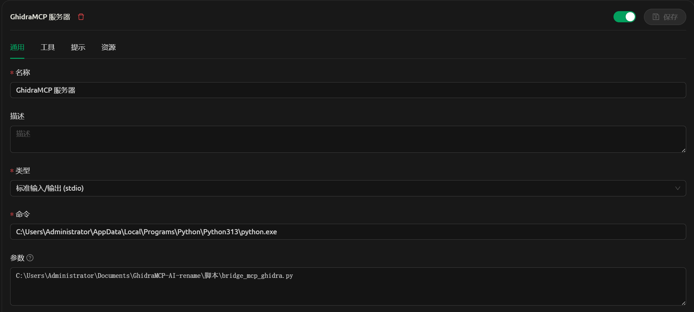

# Ghidra逆向

## 9月20日更新说明

- 新增了图形界面工具，提供更友好的用户交互体验
- 支持通过GUI配置API密钥、模型参数和处理选项
- 实现了任务进度可视化和实时日志显示
- 添加了配置文件管理功能，可以保存和切换多套配置
- 优化了批量处理逻辑，提高了重命名的稳定性和效率
- 

### UI工具使用说明

UI目录下提供了一个图形界面工具，可以更方便地配置和运行重命名任务。

### 打包方式

在UI目录下提供了PowerShell脚本 `build.ps1`用于打包GUI应用程序。该脚本会使用PyInstaller将Python代码打包成Windows可执行文件。

~~打包步骤：~~

1. ~~确保已安装Python 3.10+和pip~~
2. ~~在UI目录下运行以下命令安装依赖：~~
   ```
   pip install -r requirements.txt
   ```
3. 运行打包脚本：
   ```
   .\build.ps1
   ```
4. 打包完成后，可执行文件将位于 `dist/Ghidra-AI-Rename-GUI/`目录下

### 使用方法

1. 运行打包好的 `Ghidra-AI-Rename-GUI.exe`文件
2. 在API配置区域填写以下信息：
   - API密钥：硅基流动平台的API密钥（没有可以点击"去注册"）
   - API网址：默认为 `https://api.siliconflow.cn/`
   - 模型名称：默认为 `Qwen/Qwen2.5-72B-Instruct`
3. 在处理参数区域配置：
   - 关键词：要重命名的函数名模式，默认为 `FUN_`
   - 每批大小：每次处理的函数数量，默认为50
   - 处理延迟：每次处理后的延迟时间（毫秒），默认为1000
4. 点击"刷新"按钮检查与Ghidra的连接状态
5. 点击"开始重命名"按钮启动重命名任务
6. 可随时点击"停止"按钮中断任务

## 基于GhidraMcp的快速逆向脚本

使用qwen7b的高速处理性，批量进行函数重命名。再导出文件便于ai解析。
逆向重写推荐cursor，记得给cursor配置MCP服务。

### 项目要求：python>3.10

在脚本目录下运行 ``pip install -r requirements.txt``

### Ghidra下载：https://github.com/NationalSecurityAgency/ghidra

### JDK21+下载：https://www.oracle.com/java/technologies/javase/jdk21-archive-downloads.html

### 樱桃下载：https://www.cherry-ai.com/download

#### 已知樱桃1.2.8-1.2.9的MCP服务器功能有bug，请下载1.2.10或更新的版本

### Ghidra安装MCP插件：

https://github.com/user-attachments/assets/75f0c176-6da1-48dc-ad96-c182eb4648c3

# 使用说明

208行 SK-XXXXXX改为自己的硅基流动密钥，然后运行[ai_先运行仅重命名.py](%E8%84%9A%E6%9C%AC/ai_%E5%85%88%E8%BF%90%E8%A1%8C%E4%BB%85%E9%87%8D%E5%91%BD%E5%90%8D.py)
等待所有的FUN_xxxx函数重命名结束后，再运行[ai_再运行文件保存.py](%E8%84%9A%E6%9C%AC/ai_%E5%86%8D%E8%BF%90%E8%A1%8C%E6%96%87%E4%BB%B6%E4%BF%9D%E5%AD%98.py)
然后配置樱桃或者cursor的MCP进行分析即可。
MCP配置中用到的python路径填已经装了依赖的路径，另一个填[bridge_mcp_ghidra.py](%E8%84%9A%E6%9C%AC/bridge_mcp_ghidra.py)
的路径。

# 樱桃配置

command填写python路径,并使用双反斜杠,args填写bridge_mcp_ghidra.py的路径.


# VS code 的cline配置

command填写python路径,并使用双反斜杠,args填写bridge_mcp_ghidra.py的路径.

```
{
  "mcpServers": {
    "GhidraMCP": {
      "name": "GhidraMcp",
      "type": "stdio",
      "description": "",
      "isActive": true,
      "command": "C:\\Users\\Administrator\\AppData\\Local\\Programs\\Python\\Python313\\python.exe",
      "args": [
        "C:\\Users\\Administrator\\Documents\\GhidraMCP-AI-rename\\脚本\\bridge_mcp_ghidra.py"
      ],
      "disabled": false,
      "autoApprove": [
        "list_imports"
      ]
    }
  }
}
```

# Cursor配置：

command填写python路径,并使用双反斜杠,args填写bridge_mcp_ghidra.py的路径.

```json
{
  "mcpServers": {
    "GhidraMcp": {
      "name": "GhidraMcp",
      "type": "stdio",
      "description": "",
      "isActive": true,
      "command": "C:\\Users\\Administrator\\AppData\\Local\\Programs\\Python\\Python313\\python.exe",
      "args": [
        "C:\\Users\\Administrator\\Downloads\\Compressed\\ghidra_11.3.1_PUBLIC_20250219\\bridge_mcp_ghidra.py"
      ]
    }
  }
}

```

# 小工具

[一键更换国内镜像源.exe](%E5%B7%A5%E5%85%B7/%E4%B8%80%E9%94%AE%E6%9B%B4%E6%8D%A2%E5%9B%BD%E5%86%85%E9%95%9C%E5%83%8F%E6%BA%90.exe)

# 需要远程协助配置请发送邮件到：

```text
666888@guanyue.fun
```
